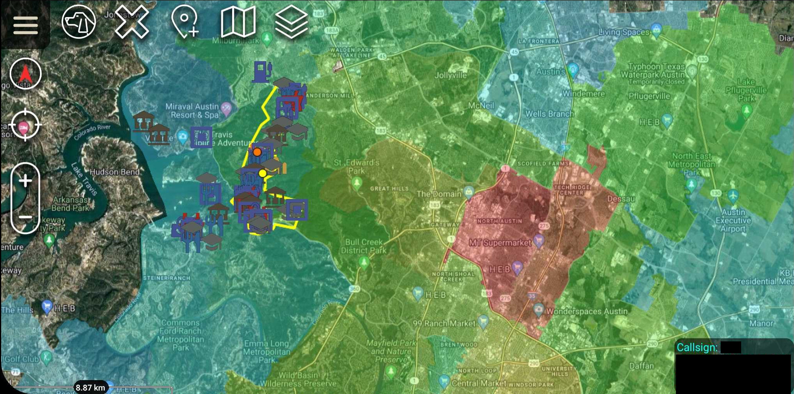

# area-study

Python program that will allow you to designate what you want marked on your area study and generates a kml layer for atak with the specified layers.
Coordinate system is in KML format: longitude, latitude, altitude
Don't use the API to debug, use the pushed example files

 Setup
`pip install -r requirements.txt`

Either edit config.ini to change program inputs and only use the config_file cli command or use cli for every entry:

```
python3 main.py 
--config-file=config.ini

--data-directory=./data
--save-directory=./save
--google-api-key=YOUR_API_KEY
--location=[upper_left_lat, upper_left_lon, lower_right_lat, lower_right_lon]
--categories=[EMERGENCY, LAW_ENFORCEMENT, etc]
--crime_soda_addr=SODA api address for your area's crime dataset
--zipcode_soda_addrSODA api address for your area's zipcode dataset
--city=nearest city
--state=state city resides in
--country-code=country code state resides in (America, USA, United States, etc)
```

# Google API Supported types:
https://developers.google.com/maps/documentation/places/web-service/supported_types

# Open Street Map Keys:
https://wiki.openstreetmap.org/wiki/Map_features

# KML Generation Example:

KML Generated for area in West Austin, Texas
